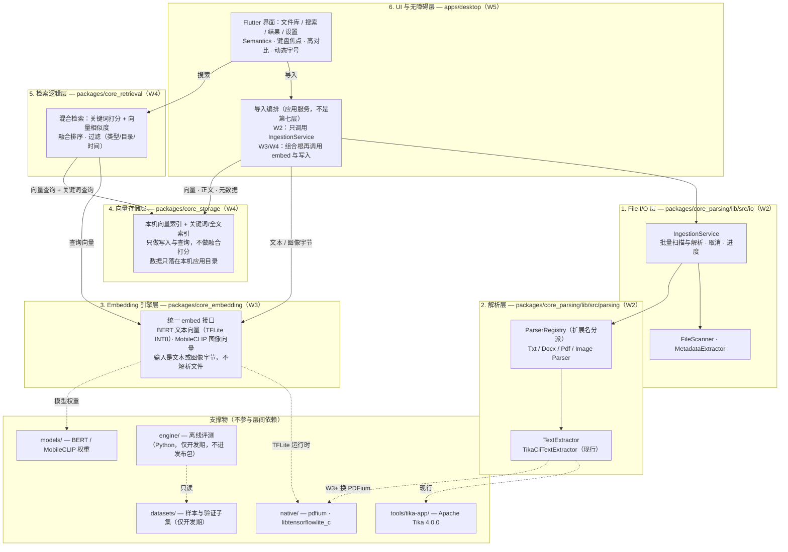
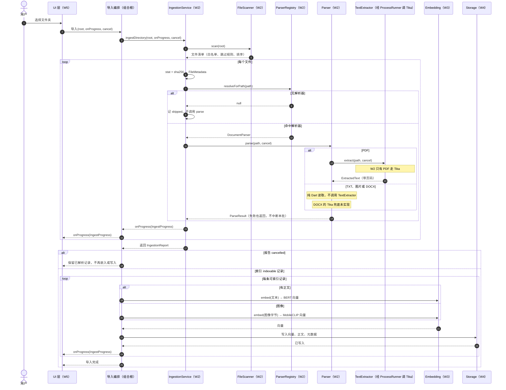
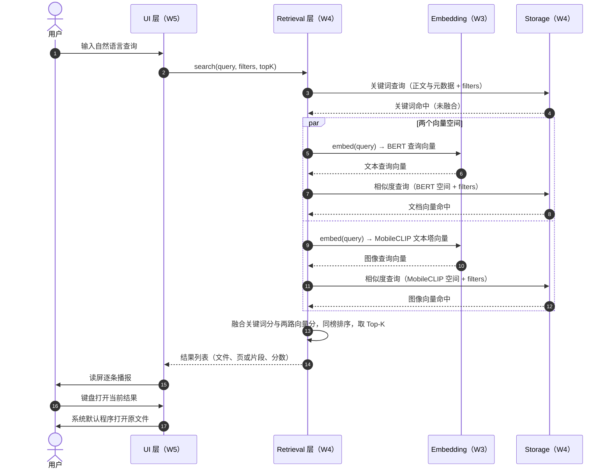

# 系统架构设计文档

## 1. 目标与约束

### 1.1 产品目标

做一个**完全离线**、开源、可在 Windows / macOS / Linux 运行的桌面工具：把本机 PDF、文档、图片建成本地索引，用自然语言或关键词搜回来，并保证视障用户能独立完成「搜索 → 看结果 → 打开」全流程。

### 1.2 架构级硬约束

| 编号 | 约束 | 架构影响 |
|---|---|---|
| C1 | **完全离线**：导入、检索、打开本地文件都不联网，默认不外传任何用户数据 | 不允许任何 model/telemetry 下载；模型与依赖全部随包分发或本机已有 |
| C2 | **跨平台**：Windows（开发主平台）、macOS、Linux | 禁止平台私有 API 直连；进程调用、路径、classpath 分隔符必须平台分支 |
| C3 | **WCAG 2.1 AA**：键盘走完全流程、控件有名称、高对比、字号放大 | 每个长任务必须可取消 + 可播报进度；状态不得只靠颜色 |
| C4 | **离线优先的性能**：批量导入不假死、可取消；已建库后检索要快 | 重活不能占 UI 线程；解析层必须支持取消与进度 |
| C5 | **可测性**：核心模块单测覆盖率最终 ≥90%（W2 解析模块 ≥80%） | 文件系统、外部进程、模型推理一律经接口注入，便于打桩 |
| C6 | **开源合规**：Apache 2.0 | 依赖许可证必须在 W7 逐项核对；native 二进制与模型权重单独记录来源 |

## 2. 架构原则

1. **单向依赖**：上层依赖下层，下层不知道上层的存在；跨层只经接口，不 import 实现。
2. **纯逻辑与副作用分离**：解析、打分、切块是可测的纯逻辑；文件读写、进程、模型推理是副作用，藏在 `spi/`（Service Provider Interface）后面。
3. **失败隔离**：一个坏文件不能中断一批文件；错误用`ParseFailure`，不用异常穿层。
4. **契约先行**：接口在实现之前冻结（W2 Day 1 完成），实现按接口填充。
5. **离线即默认**：任何"要联网才能跑"的设计都视为缺陷，而不是配置问题。

---

## 3. 六层架构图



实线是调用方向，含尚未落地的 W3–W5。虚线是可替换实现或开发期数据，不进入层间依赖。

导入和搜索分开走。导入编排放在 `apps/desktop` 的组合根：W2 只调用 `IngestionService`（扫描 + 解析）；W3/W4 再依次把文本或图像字节送给 Embedding、把向量和正文写入存储。`core_parsing` 不依赖上层包。检索层同时调用 Embedding 和存储层，这两层互不依赖。关键词索引进存储层，融合打分留在检索层。L1、L2 标 W2 表示本周范围；接口已冻结。

### 3.1 各层职责与边界

| 层 | 职责（做什么） | 明确不做 | 周次 |
|---|---|---|---|
| **1. File I/O** | 目录递归扫描、白名单过滤、隐藏/临时文件跳过、`stat` 元数据、内容哈希；`IngestionService` 编排扫描和解析，带进度与取消 | 不解析正文、不调用嵌入、不写索引 | W2 |
| **2. Parsing** | 按扩展名分派；TXT/PDF/DOCX/JPG/PNG → 文本分页 + 图像元数据 + `ParseOutcome` | 不做向量化、不做 OCR、不做 UI 文案 | W2 |
| **3. Embedding Engine** | 统一 `embed()`；文本走 BERT(TFLite)、图像走 MobileCLIP；批处理。输入由导入编排传入 | 不解析文件、不知道向量存哪 | W3 |
| **4. Vector Storage** | 本地持久化向量索引和关键词/全文索引、查询、按元数据删除 | 不打分、不排序、不融合关键词与向量 | W4 |
| **5. Retrieval Logic** | 同时取查询向量和两类索引，做混合打分、排序、过滤、Top-K | 不碰文件系统、不直接读原始文件、不写索引 | W4 |
| **6. UI 与无障碍** | 四个界面、Semantics、焦点顺序、高对比、字号；导入编排在应用服务里依次调用下层 | Widget 不读文件、不算相似度、不直接写索引 | W5 |

### 3.2 横切关注点

| 关注点 | 归属 | 约定 |
|---|---|---|
| 错误模型 | 各级共用的 `model/` 值对象 | 用 `ParseFailure` / 返回码表达可预期失败；异常只用于编程错误 |
| 取消 | `spi/CancellationToken` | 协作式；长任务在安全点调用 `throwIfCancelled()` |
| 并发调度 | `spi/Executor` | W2 用 `ImmediateExecutor`；W6 可换成 worker isolate，调用方不改 |
| 外部进程 | `spi/ProcessRunner` | 全包唯一允许 spawn 进程的位置 |
| 日志 | （W7 统一） | 绝不记录文件正文；只记路径、大小、耗时、错误类型 |

---

## 4. 仓库目录映射

```text
accessible-multimodal-retrieval/
├─ apps/desktop/                     # 6. UI 与无障碍层（Flutter，W5）；导入编排在组合根
│  └─ pubspec.yaml                   #    W2：以 path 依赖引入 core_parsing
├─ packages/
│  ├─ core_parsing/                  # 1+2. File I/O + Parsing（W2）
│  │  ├─ lib/core_parsing.dart       #    唯一公开入口（barrel）
│  │  ├─ lib/src/model/              #    跨层值对象
│  │  ├─ lib/src/spi/                #    注入缝：ProcessRunner / Executor / CancellationToken / TextExtractor
│  │  ├─ lib/src/parsing/            #    DocumentParser + ParserRegistry
│  │  │  ├─ parsers/                 #    txt / docx / pdf / image
│  │  │  └─ adapters/                #    TikaCliTextExtractor
│  │  ├─ lib/src/io/                 #    FileScanner / MetadataExtractor / IngestionService
│  │  ├─ tool/                       #    夹具生成等开发脚本
│  │  └─ test/                       #    单测 + fixtures
│  ├─ core_embedding/                # 3. Embedding 引擎（W3）
│  ├─ core_storage/                  # 4. 向量存储（W4）
│  └─ core_retrieval/                # 5. 检索逻辑（W4）
├─ native/                           # FFI 产物（不入库二进制，只留结构与 README）
│  ├─ pdfium/{windows,include,tests} #    PDFium 动态库与头文件预留位
│  ├─ tflite/windows/                #    libtensorflowlite_c 预留位
│  └─ gtest/                         #    Google Test（原生单测）
├─ engine/                           # 离线评测脚本（Python + Chroma，仅开发期，不进发布包）
├─ datasets/                         # 样本 + 验证子集（图片按 .gitignore 不入库）
├─ models/                           # 模型权重（.gitignore 排除实体文件）
├─ tools/tika-app/                   # Apache Tika 4.0.0 发行版（jar 不入库）
├─ docs/                             # 架构 / API / TDD / 任务文档
└─ reports/                          # 每周交付报告与证据
```

### 4.1 「新增一种格式要改哪几个文件」

| 步骤 | 文件 | 说明 |
|---|---|---|
| 1 | `lib/src/parsing/parsers/xxx_parser.dart` | 实现 `DocumentParser`，只做纯逻辑 |
| 2 | `lib/src/parsing/parser_registry.dart` 的装配处 | 注册一行：扩展名 → parser |
| 3 | `test/fixtures/` + `tool/make_fixtures.py` | 加夹具（含一个损坏样本） |
| 4 | `test/parsing/xxx_parser_test.dart` | 正常 / 损坏 / 边界三类用例 |

其余四层无需改动 —— 这是本架构对"模块化、可维护"的可验证回答。

---

## 5. 依赖方向与跨层契约

```text
导入：
  UI → 导入编排
         ├─ IngestionService
         │    ├─ FileScanner / MetadataExtractor
         │    └─ Parsing → TextExtractor
         ├─ Embedding          （文本 / 图像字节）
         └─ Storage            （向量 · 正文 · 元数据）

搜索：
  UI → Retrieval
         ├─ Embedding          （查询向量）
         └─ Storage            （向量查询 + 关键词查询）
```

规则：

- **R1** 下层不得依赖上层。`core_parsing` 不 import `core_embedding`、`core_storage`、`core_retrieval`。
- **R1a** 导入编排在应用组合根，可以依次调用 File I/O、Parsing、Embedding、Storage。Embedding 不调用 Parsing，也不调用 Storage；写入由编排者完成。
- **R1b** 检索层同时依赖 Embedding 与 Storage。Storage 不调用 Embedding。
- **R2** 层与层之间传 `ParsedDocument` / `FileMetadata` / `IngestRecord` 这类**不可变值**，不传文件句柄、不传 `File` 对象。交给 Embedding 的是文本或图像字节，交给 Storage 的是向量、正文和元数据。
- **R3** 副作用（文件、进程、模型、存储）必须经 `spi/` 接口注入；`dart:io` 的 `Process` 只允许出现在 `spi/` 的实现里。
- **R4** Widget 不得 `import 'dart:io'` 读文件。导入由应用服务编排，搜索只消费检索层返回的结果。

---

## 6. 冻结的公共接口（Week 2）

入口：`packages/core_parsing/lib/core_parsing.dart`（`lib/src/` 下均为实现细节）。

### 6.1 值对象（`lib/src/model/`）

| 类型 | 作用 | 关键成员 |
|---|---|---|
| `ParseOutcome` | 解析/入库的分类词汇表 | `ok` / `partial` / `skipped` / `failed`，`isUsable` |
| `DocumentPage` | 一页文本 | `pageNumber`（1 起）、`text`、`isEmpty`、`charCount` |
| `ImageAsset` | 图像描述（W2 只到元数据） | `format`、`width`、`height`、`colorMode`、`pixelCount`、`aspectRatio` |
| `ParsedDocument` | 一个文件的解析产物 | `fullText`、`pages`、`imageAsset`、`attributes`、`outcome`、`warnings`、`pageCount`、`hasText`、`isImageOnly` |
| `ParseFailure` | 结构化失败 | `kind`、`message`、`detail`、`outcome`（kind → outcome 的降级策略） |
| `ParseResult` | 解析结果联合体 | `document` / `failure` / `duration` / `outcome` / `isSuccess` |
| `FileMetadata` | 文件元数据 | `id`、`path`、`relativePath`、`extension`、`sizeBytes`、`mimeType`、`createdAt/modifiedAt/accessedAt`、`contentHash`、`parserName`、`status`、`imageAsset` |
| `IngestRecord` | 单文件入库记录 | `metadata`、`document`、`failure`、`outcome`、`hasContent` |
| `IngestionReport` | 一次批量入库汇总 | `records`、`succeeded/partial/skipped/failed`、`failures`、`indexable`、`isClean`、`cancelled` |
| `IngestProgress` | 进度通知（无障碍播报用） | `processed`、`total`、`currentPath`、`elapsed`、`fraction` |

所有值对象均为 `@immutable`，实现 `== / hashCode / toString / toJson()`。

### 6.2 接口（`lib/src/parsing/`、`lib/src/spi/`）

```dart
abstract interface class DocumentParser {
  String get name;                          // 'txt' | 'docx' | 'pdf' | 'image'
  String get version;                       // 解析行为变化就 +1，保证基准可比
  Set<String> get supportedExtensions;      // {'.pdf'}，小写带点
  Future<ParseResult> parse(String absolutePath, {CancellationToken? cancel});
}

abstract interface class ParserRegistry {
  List<DocumentParser> get parsers;
  Set<String> get supportedExtensions;
  DocumentParser? resolveForExtension(String extension);
  DocumentParser? resolveForPath(String absolutePath);
  bool supports(String absolutePath);
}

abstract interface class TextExtractor {
  String get name;
  String get version;
  Future<ExtractedText> extract(String absolutePath, {CancellationToken? cancel});
}

abstract interface class ProcessRunner {
  Future<ProcessRunResult> run(String executable, List<String> arguments,
      {String? workingDirectory, Map<String, String>? environment,
       Duration? timeout, CancellationToken? cancel});
}

abstract interface class Executor {
  Future<T> run<T>(Future<T> Function() action);
}

class CancellationToken { bool get isCancelled; void throwIfCancelled(); ... }
class CancellationTokenSource { CancellationToken get token; void cancel(); }
```

### 6.3 契约条款（实现者必须遵守）

| 条款 | 内容 |
|---|---|
| P1 | `DocumentParser.parse` 不得因文件本身的问题抛异常；损坏/不支持/缺依赖一律返回 `ParseResult.failure` |
| P2 | 解析耗时必须写入 `ParseResult.duration`（性能基准要用） |
| P3 | 长任务在每个文件边界与每个分页边界检查 `cancel.throwIfCancelled()` |
| P4 | 只有 `ProcessRunner` 的实现可以 `Process.run`；解析器只依赖接口 |
| P5 | 外部进程的 stdout 才是正文，stderr 只作诊断（Tika 会往 stderr 打 INFO 噪声） |
| P6 | 分页：PDF 一页一条 `DocumentPage`；TXT/DOCX 单页；图像无文本 |
| P7 | 编码：TXT 必须支持 UTF-8 / UTF-8 BOM / UTF-16 LE·BE / GBK，降级时写 `warnings`（如 `encoding-fallback:gbk`） |
| P8 | 任何日志/报告不得包含文件正文（隐私约束 C1） |

---

## 7. 三层工程结构（包 / 应用 / 支撑）

| 类型 | 内容 | 是否进入发布包 |
|---|---|---|
| **Dart 包** | `packages/core_*` | 是（编译进 Flutter 应用） |
| **Flutter 应用** | `apps/desktop` | 是 |
| **native 产物** | `native/pdfium`、`native/tflite` | 是（动态库随包） |
| **开发期脚本** | `engine/`（Python 评测）、`tools/tika-app`（PDF 解析兜底） | `engine/` 否；`tools/tika-app` 见 ADR 0002 |
| **数据集与权重** | `datasets/`、`models/` | 样本随包；验证子集与权重不入仓库 |

---

## 8. 端到端数据流

### 8.1 索引（摄入）流程

W2 收到 `IngestionReport` 即停。嵌入和写入在 W3/W4 由导入编排按 `indexable` 逐条调用，不进入 `IngestionService`。



### 8.2 检索流程（W4/W5 目标态）

关键词查询不依赖向量。文档和图像分属 BERT 与 MobileCLIP 两个空间，查询要做两次 `embed(query)`。存储只返回命中，融合在检索层。返回单位写「页或片段」，切块策略仍见 TDD 的 Q3。



---

## 9. 进程 / 线程 / 隔离模型

| 执行体 | 承载内容 | W2 状态 | 后续 |
|---|---|---|---|
| **Flutter UI isolate** | 界面、事件、取消源 | 未接入 | W5 |
| **主 isolate（Dart）** | 扫描、编排、TXT/DOCX/图像解析、元数据 | **W2 落地** | 纯 CPU 部分（XML/图像解码）在 W6 视实测结果移入 worker isolate |
| **worker isolate** | 批量解析（可选） | 接口已预留（`Executor`） | W6 |
| **外部进程** | `java` + Tika，只服务 PDF | W2 落地 | W3+ 由 PDFium FFI 替代以去掉 JVM |
---

## 10. 错误分层与降级策略

| 失败场景 | 表达 | 分类 | 对整批的影响 |
|---|---|---|---|
| 扩展名无解析器 | `ParseFailure(unsupportedFormat)` | `skipped` | 跳过，计数 |
| 文件权限不足 | `ParseFailure(permissionDenied)` | `skipped` | 跳过，计数 |
| 文件损坏 / 非声明格式 | `ParseFailure(corruptedInput)` | `failed` | 跳过该文件，继续批 |
| 缺 JDK（PDF 路径） | `ParseFailure(dependencyUnavailable)` | `failed` | 跳过该文件；报告单列，用户可修环境后重跑 |
| 外部进程超时 | `ParseFailure(timeout)` | `failed` | 跳过该文件 |
| 文件超过大小上限 | `ParsedDocument(outcome: partial)` + `warnings` | `partial` | 入库但标记截断 |
| 编码无法识别 | 降级为 GBK/latin1 + `warnings` | `ok`/`partial` | 正常入库 |
| 用户取消 | `CancelledException` 冒泡到编排层 | 报告 `cancelled=true` | 停止处理剩余文件，已完成的记录保留 |
| 编程错误（bug） | 抛异常 | — | 必须修，不允许靠 catch 掩盖 |

`failed` 表示"这个文件不行"，`skipped` 表示"我们没打算处理它"。报告把两者分开，避免把正常的格式过滤当成缺陷（W2 覆盖率与报告口径都以此为准）。

---

## 11. 安全与隐私（架构级）

| 要求 | 实现方式 |
|---|---|
| 不联网 | 运行时不发起任何网络请求；模型与依赖随包或本机已存在（C1） |
| 不外传 | 无遥测、无崩溃上报、无云同步 |
| 数据落地位置 | 索引数据只写本机应用目录（W4 定义具体路径），提供"清除索引" |
| 日志 | 只记路径/大小/耗时/错误类型；永不记录文件正文（契约 P8） |
| 仓库卫生 | `.gitignore` 排除 `.venv/`、`chroma_data/`、模型权重、非 samples 的数据集图片（对应风险 R9） |
| 进程调用 | 只调用本机已知可执行文件（`java`），参数为固定模板 + 文件路径，不做 shell 拼接 |

---

## 12. 无障碍的前置架构约束（WCAG 2.1 AA 对齐）

1. **可播报的进度**：`IngestProgress` 强制同时携带 `processed` 与 `total`（不允许只有百分比），UI 才能缝合成完整句子给读屏。
2. **可取消**：所有长任务（扫描、解析、后续的嵌入与检索）都接受 `CancellationToken`，键盘用户必须能中止而不是干等。
3. **状态可文本化**：`ParseOutcome` 与 `ParseFailure.kind` 是可枚举的结构化值，UI 可翻译成"成功/部分内容/已跳过/失败"，不依赖颜色区分。
4. **结果可被读屏逐项消费**：`FileMetadata` 自带 `fileName`、`relativePath`、`mimeType`、`modifiedAt`，结果列表无需再次访问文件系统即可播报。

---

## 13. 测试策略与覆盖率口径

| 层级 | 手段 | W2 目标 |
|---|---|---|
| 逻辑层（`lib/`） | `dart test` 单测，注入假 `ProcessRunner` / 夹具文件 | **行覆盖率 ≥80%** |
| 外部集成（真 Java、真 PDF/DOCX） | 集成测试读 `datasets/samples/`，标记 `@Tags(['integration'])` | 冒烟通过即可 |
| UI | `flutter test`（W5 起） | — |
| 原生 | Google Test（W3 起，`native/gtest/`） | — |
| 覆盖率口径 | 只统计 `packages/core_parsing/lib/`；`coverage/lcov.info` 的 `LF/LH` 汇总 | 证据入 `reports/week2/` |

**不允许**用"跑真 Java"来凑覆盖率：外部进程一律经 `ProcessRunner` 打桩（契约 P4）。

---

## 14. 决策记录（ADR）索引

| 编号 | 决策 | 状态 |
|---|---|---|
| [ADR 0001](adr/0001-parsing-runtime-dart-package.md) | 解析模块做成独立纯 Dart 包 `packages/core_parsing` | 已采纳 |
| [ADR 0002](adr/0002-pdf-extraction-tika-then-pdfium.md) | PDF 文本抽取先用 Apache Tika CLI，PDFium FFI 后续替换 | 已采纳（带迁移触发条件） |
| ADR 0003（待写，W4） | 向量存储选型：Chroma Dart FFI vs SQLite + 近邻 | 未决 |
| ADR 0004（待写，W6） | 是否把批量解析移入 worker isolate | 未决 |


