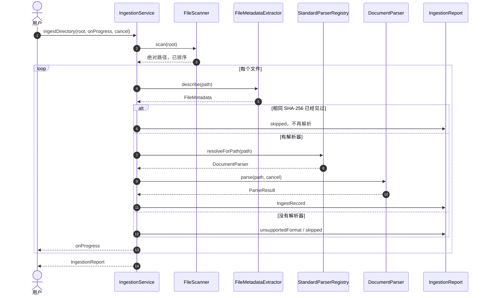
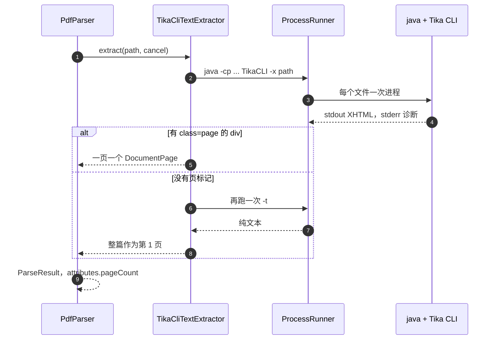

# 技术设计文档（TDD）

**Offline Accessible Multimodal Local Content Retrieval System**
---

## 1. 数据流

用户选一个目录。`IngestionService` 扫描白名单文件，为每个文件做元数据，再按扩展名解析。成功或失败都变成一条 `IngestRecord`。W3 只消费 `indexable`，不重新读盘。

PDF 是唯一在 W2 启动外部进程的格式。DOCX、TXT、JPEG、PNG 都在 Dart 里完成。

`-x` 的 stdout 里没有 page div 时再跑 `-t`。这包括 `-x` 退出码非 0、但正文里没有页。超时和 Java 启动失败会直接抛出，不再跑 `-t`。两次都失败时抛 `TextExtractionException`，stderr 留在异常里，不进正文。`PdfParser` 把启动失败记成 `dependencyUnavailable`，把超时记成 `timeout`，把提取异常记成 `corruptedInput`，都是 `failed`。同批其他文件继续。

## 2. 解析层

包是 `packages/core_parsing`，公开入口是 `lib/core_parsing.dart`。桌面应用用 path 依赖引用它，界面代码不读文件。

| 格式 | 实现 | 失败时 |
|---|---|---|
| TXT | `TxtParser`。UTF-8、UTF-8 BOM、UTF-16 LE/BE，否则 GBK。换行收成 `\n` | 超过 10 MB 为 `partial`。GBK 兜底写 warning。缺失文件为 `failed` |
| DOCX | `DocxParser` 解 `word/document.xml`。`w:tab` / `w:br` 保留。core.xml 有值才写 title、creator、created | 坏 zip 或缺少 document.xml 为 `corruptedInput`。没有 core.xml 时正文仍成功 |
| PDF | `PdfParser` 只依赖 `TextExtractor`。W2 的实现是 `TikaCliTextExtractor` | 缺 Java、超时、Tika 非 0 退出分别是 `dependencyUnavailable`、`timeout`、`corruptedInput` |
| JPG / PNG | `ImageParser` 读尺寸和格式，正文为空，不 OCR | 空文件或伪装扩展名为 `corruptedInput` |

扩展名分派只在 `StandardParserRegistry`。未知扩展名不抛异常。新增一种格式要加一个解析器类，并在构造注册表时多传一个实例。

扫描跳过点开头的名字、`~$` 临时文件和两个系统目录，不跟随符号链接。元数据里的 `createdAt` 使用 `stat.changed`。相同 SHA-256 的第二个文件跳过解析。默认两个文件并行，执行器仍是当前 isolate 上的 `ImmediateExecutor`。

坏根目录不让调用方崩溃：不存在或不是目录记一条 `failed`，列目录时权限不足记一条 `skipped`。

## 3. 单文件耗时

 `reports/week2/logs/day3_jvm_single_file.txt`，命令是 `parse_probe.dart --path datasets/samples`。毫秒数是解析器自己的 `ParseResult.duration`，PDF 那一条包含一次 JVM 启动。

| 文件 | 路径 | 耗时 | 结果 |
|---|---|---|---|
| sample.docx | 纯 Dart | 73 ms | ok，1 页，1499 字符 |
| sample.pdf | Tika CLI，一次 JVM | 4857 ms | ok，2 页，4358 字符 |
| sample.png | 纯 Dart | 75 ms | ok，1186×1137，png / rgb |

Day 4 对同一目录又跑了一次探针，原始输出在 `reports/week2/logs/ingest_samples.txt`：docx 80 ms，pdf 5215 ms，png 80 ms。同一份日志里，50 张 coco JPEG 为 1400 ms，16 张 rvlcdip PNG 为 651 ms。这两批不启动 JVM。

因此 W2 保持「每个 PDF 一次进程」。常驻 JVM 或 PDFium 留到 Q1 / Q6，不在本周改接口。页边界见 Q7。

## 4. 未决问题

Owner 一列是负责在对应周次做决定的角色，不是已经派给某个后续提交的任务编号。

| 编号 | 问题 | 倾向 | Owner | 解决周次 |
|---|---|---|---|---|
| Q1 | ORT/PDFium 是否都能拿到可信的预编译产物？拿不到怎么办 | 优先预编译；退化时保留 Tika。接口仍是 `TextExtractor` | Week 2 架构 | W3 |
| Q2 | `engine/`（Python + Chroma）是否进入发布包 | **不进入**：只做离线评测，发布版存储由 Dart 侧实现 | Week 2 架构 | W4 |
| Q3 | 长文档切块策略（按页 / 按段 / 按 token 窗口） | 按页优先，段内再切。TXT/DOCX 目前整篇作为一页 | Week 2 架构 | W3–W4 |
| Q4 | 扫描件（RVL-CDIP）是否引入 OCR | 先走图像向量，基准不达标再加。W2 只登记图像元数据 | Week 2 架构 | W6 |
| Q5 | 图像-only 文档如何在结果列表里排序与展示 | 与文本同榜，展示缩略图 + 尺寸 | Week 2 架构 | W4 |
| Q6 | 批量解析是否需要 worker isolate | PDF 单文件 4857 ms，见 `reports/week2/logs/day3_jvm_single_file.txt`。W2 仍用 `ImmediateExecutor` | Week 2 架构 | W6 |
| Q7 | PDF 页码策略会不会随 PDFium 改变 | W2 以 Tika `-x` 的 page div 为准，没有则整篇一页。替换实现时仍要填 `DocumentPage` | Week 2 架构 | W3 |
