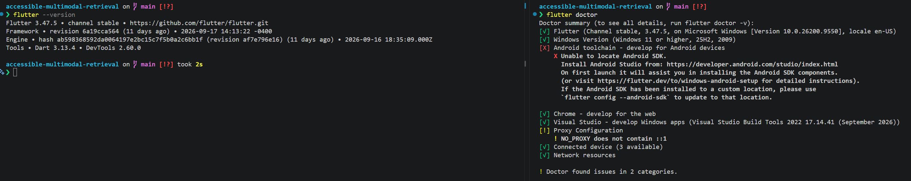
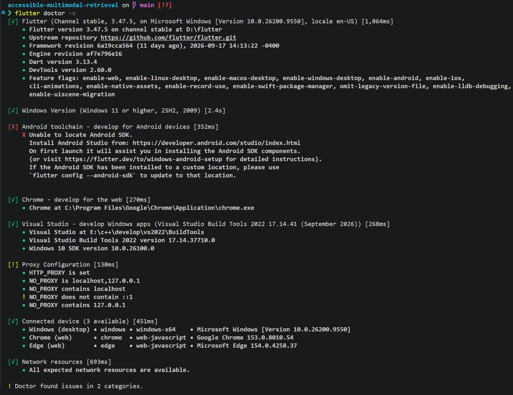
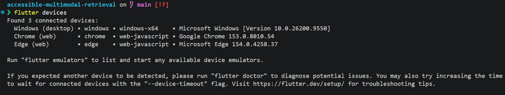
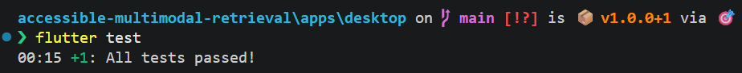
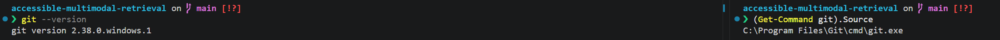
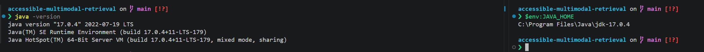
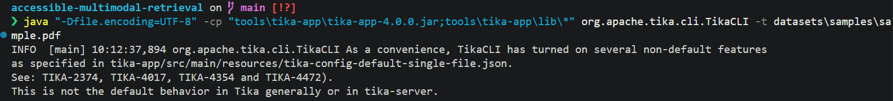
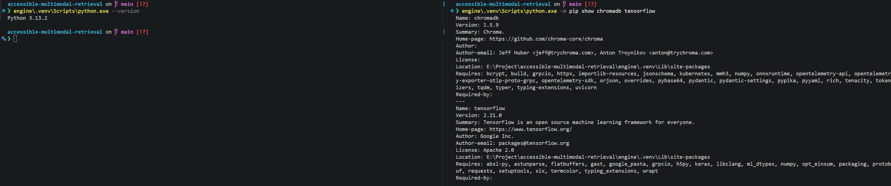
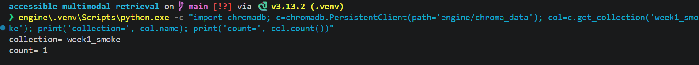
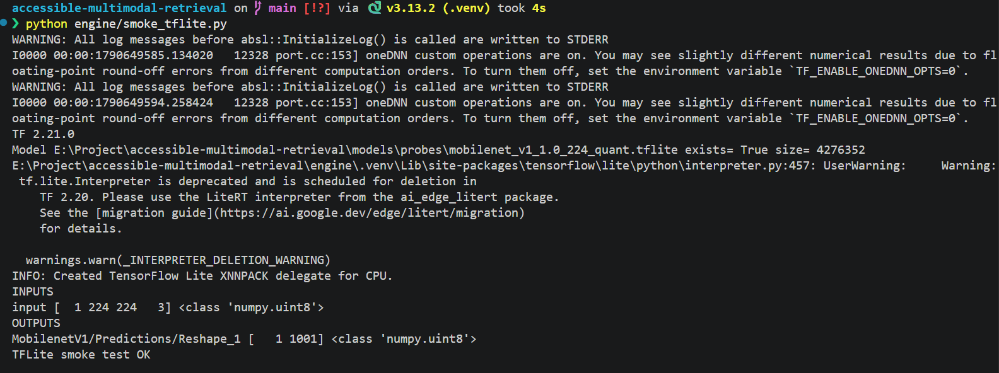

# 环境搭建验证报告

- 日期：2026-09-24
- 系统：Microsoft Windows 11 25H2
- 范围：Windows 桌面开发。项目目标平台是 Windows、macOS、Linux。
- 结论：Flutter、Git、Java、Python 虚拟环境、Chroma、TensorFlow Lite 和 Apache Tika 均可在本机运行。

---
## 1.测试范围与环境
### 1.1 测试范围

- Flutter SDK、Windows 桌面工具链、设备枚举
- `apps/desktop` 模板工程冒烟测试
- Git | GitHub 仓库规范与 CI |
- JDK 17 + Apache Tika 对样本 PDF 抽文本
- `engine/.venv` + Chroma 本地集合读写
- TensorFlow Lite 探针模型加载与推理
- 本地样本文件 `datasets/samples/sample.pdf` 可读

### 1.2 测试环境
操作系统：Microsoft Windows 11 25H2
目标产品平台：Windows、macOS、Linux
Flutter SDK：stable 3.47.5，安装路径 D:\flutter Dart：3.13.4
桌面编译工具链：Visual Studio Build Tools 2022 17.14.41
Windows SDK：Windows 10 SDK 10.0.26100.0
Git：2.38.0.windows.1，C:\Program Files\Git\cmd\git.exe
Java：17.0.4 LTS，JAVA_HOME=C:\Program Files\Java\jdk-17.0.4
Python 虚拟环境：engine/.venv，Python 3.13.2
Chroma DB：chromadb 1.5.9，本地集合 week1_smoke
TensorFlow / TFLite：tensorflow 2.21.0
Apache Tika：tika-app 4.0.0
样本输入：datasets/samples/sample.pdf

---
## 2.测试模块与用例统计

### 2.1 模块汇总
| 模块 | 用例 ID | 用例数 | 通过 | 失败 | 未测 | 测的功能 |
|---|---|---|---|---|---|---|
| Flutter 工具链 | ENV-01 ~ ENV-03 | 3 | 3 | 0 | 0 | SDK 安装、Windows 桌面编译、设备枚举 |
| Flutter 工程冒烟 | ENV-04 | 1 | 1 | 0 | 0 | 模板工程单元测试可运行 |
| 版本控制 | ENV-05 | 1 | 1 | 0 | 0 | Git 可执行 |
| 文档解析依赖 | ENV-06 ~ ENV-07 | 2 | 2 | 0 | 0 | JDK 可用；Tika 抽取 PDF 正文 |
| Python 运行时 | ENV-08 | 1 | 1 | 0 | 0 | 虚拟环境可用 |
| 向量存储 | ENV-09 | 1 | 1 | 0 | 0 | Chroma 打开本地库并访问集合 |
| ML 推理框架 | ENV-10 | 1 | 1 | 0 | 0 | TFLite 探针模型加载并推理 |
| **合计** | — | **12** | **11** | **0** | **0** | — |

### 2.2 测试用例
| 用例 ID | 模块 | 测的功能 | 结果 |
|---|---|---|---|
| ENV-01 | Flutter 工具链 | `flutter doctor` 确认 SDK 与桌面工具链可用 | 通过 |
| ENV-02 | Flutter 工具链 | Windows 桌面编译依赖（VS Build Tools + Win SDK）就绪 | 通过 |
| ENV-03 | Flutter 工具链 | `flutter devices` 枚举到 Windows、Chrome、Edge | 通过 |
| ENV-04 | Flutter 工程冒烟 | `apps/desktop` 模板测试 `Counter increments smoke test` | 通过 |
| ENV-05 | 版本控制 | `git --version` 可执行 | 通过 |
| ENV-06 | 文档解析依赖 | JDK 17 与 `JAVA_HOME` 有效 | 通过 |
| ENV-07 | 文档解析 | Tika CLI 从样本 PDF 抽取纯文本 | 通过 |
| ENV-08 | Python 运行时 | `engine/.venv` 中 Python 3.13.2 可用 | 通过 |
| ENV-09 | 向量存储 | Chroma 打开本地库，集合 `week1_smoke` 可访问 | 通过 |
| ENV-10 | ML 推理框架 | TFLite 探针模型加载成功并输出约定成功标记 | 通过 |
---

## 3. 详细测试用例
### ENV-01 Flutter SDK 安装验证

- **模块**：Flutter 工具链
- **测试功能**：本机 Flutter SDK 可执行，doctor 无阻塞级错误
- **前置条件**：已安装 Flutter stable，路径 `D:\flutter`，已加入 PATH
- **步骤 / 命令**：

```bat
flutter --version
flutter doctor
```

- **期望结果**：
  - Flutter 版本为 stable 通道
  - `flutter doctor` 显示 SDK、Windows 桌面工具链可用，无导致无法开发的红色阻塞项
- **实际结果（example）**：
  - Flutter stable **3.47.5**
  - Dart **3.13.4**
  - 安装路径 `D:\flutter`
  - doctor 确认 SDK、Windows 版本、Chrome、Visual Studio 桌面工具链可用
- **判定**：通过
- **证据**：`reports/week1/env_flutter.txt`；截图 `screenshots/ENV-01-flutter-doctor.png`

---

### ENV-02 Windows 桌面编译工具链

- **模块**：Flutter 工具链
- **测试功能**：Windows 桌面目标可编译（Visual Studio Build Tools + Windows SDK）
- **前置条件**：ENV-01 通过
- **步骤 / 命令**：

```bat
flutter doctor -v
```

- **期望结果**：检测到 Visual Studio Build Tools 2022 与可用的 Windows 10 SDK
- **实际结果（example）**：
  - Visual Studio Build Tools 2022 **17.14.41**
  - Windows 10 SDK **10.0.26100.0**
- **判定**：通过
- **证据**：`reports/week1/env_flutter.txt`；截图 `screenshots/ENV-02-windows-toolchain.png`

---

### ENV-03 Flutter 可用设备枚举

- **模块**：Flutter 工具链
- **测试功能**：本机至少能列出 Windows 桌面设备，便于后续 UI 调试
- **前置条件**：ENV-01、ENV-02 通过
- **步骤 / 命令**：

```bat
flutter devices
```

- **期望结果**：设备列表包含 Windows 桌面；允许同时列出 Chrome / Edge 作为辅助设备
- **实际结果（example）**：枚举到 **Windows、Chrome、Edge** 共 3 个设备
- **判定**：通过
- **证据**：`reports/week1/week1_flutter_devices.txt`；截图 `screenshots/ENV-03-flutter-devices.png`

---

### ENV-04 Flutter 模板工程单元测试冒烟

- **模块**：Flutter 工程冒烟
- **测试功能**：Flutter Test 框架在 `apps/desktop` 工程中可运行，桌面工程测试通路打通
- **前置条件**：ENV-01 ~ ENV-03 通过，`apps/desktop` 为 Flutter 模板工程
- **步骤 / 命令**：
```bat
cd apps\desktop
flutter test
```

- **输入 example**：模板自带测试 `Counter increments smoke test`（点击计数器后数值 +1）
- **期望结果**：该用例通过，测试进程退出码 0
- **实际结果（example）**：`Counter increments smoke test` **通过**
- **范围说明**：本用例只证明测试框架与工程可跑，**不是**检索、解析或无障碍业务测试
- **判定**：通过
- **证据**：`reports/week1/week1_flutter_test.txt`；截图 `screenshots/ENV-04-flutter-test.png`

---

### ENV-05 Git 可用性

- **模块**：版本控制
- **测试功能**：系统能调用 Git，满足后续代码管理
- **步骤 / 命令**：

```bat
git --version
(Get-Command git).Source
```

- **期望结果**：输出 Git 版本，可执行文件路径存在
- **实际结果（example）**：

```text
git version 2.38.0.windows.1
```

可执行文件位于 `C:\Program Files\Git\cmd\git.exe`

- **判定**：通过
- **证据**：`reports/week1/env_git.txt`；截图 `screenshots/ENV-05-git-version.png`

---

### ENV-06 JDK 17 可用性

- **模块**：文档解析依赖
- **测试功能**：Apache Tika 运行所需的 JDK 17 与 `JAVA_HOME` 配置正确
- **步骤 / 命令**：

```bat
java -version
$env:JAVA_HOME
```

- **期望结果**：Java 17 LTS；`JAVA_HOME` 指向 JDK 17 安装目录
- **实际结果（example）**：

```text
java version "17.0.4" 2022-07-19 LTS
Java(TM) SE Runtime Environment (build 17.0.4+11-LTS-179)
Java HotSpot(TM) 64-Bit Server VM (build 17.0.4+11-LTS-179, mixed mode, sharing)
```

`JAVA_HOME=C:\Program Files\Java\jdk-17.0.4`

- **判定**：通过
- **证据**：`reports/week1/env_java.txt`；截图 `screenshots/ENV-06-java-version.png`

---

### ENV-07 Apache Tika 抽取 PDF 正文

- **模块**：文档解析
- **测试功能**：Tika CLI 在离线条件下从本地 PDF 抽出纯文本，作为后续 Parsing Layer 的依赖冒烟
- **前置条件**：ENV-06 通过；存在 `tools\tika-app\tika-app-4.0.0.jar` 与 `datasets\samples\sample.pdf`
- **输入 example**：`datasets\samples\sample.pdf`
- **步骤 / 命令**：

```bat
java -cp "tools\tika-app\tika-app-4.0.0.jar;tools\tika-app\lib\*" org.apache.tika.cli.TikaCLI -t datasets\samples\sample.pdf
```

- **期望结果**：进程退出码为 0；标准输出包含 PDF 正文，而不是空输出或异常堆栈
- **实际结果（example）**：Tika **4.0.0** 成功抽出正文，进程退出码 **0**。完整抽取文本见 `week1_tika_pdf.txt`
- **范围说明**：本周只验证 PDF 一种格式、一个样本文件；DOCX / TXT / 图片 OCR 不在本用例内
- **判定**：通过
- **证据**：`reports/week1/week1_tika_pdf.txt`；截图 `screenshots/ENV-07-tika-pdf.png`

---

### ENV-08 Python 虚拟环境

- **模块**：Python 运行时
- **测试功能**：引擎侧虚拟环境可用，后续 Chroma / TensorFlow 安装隔离于系统 Python
- **步骤 / 命令**：

```bat
engine\.venv\Scripts\python.exe --version
engine\.venv\Scripts\python.exe -m pip show chromadb tensorflow
```

- **期望结果**：虚拟环境 Python 可启动；关键依赖可查询到版本号
- **实际结果（example）**：

```text
Python 3.13.2
chromadb 1.5.9
tensorflow 2.21.0
```

- **判定**：通过
- **证据**：`reports/week1/env_python.txt`；截图 `screenshots/ENV-08-python-venv.png`

---

### ENV-09 Chroma DB 本地库与集合访问

- **模块**：向量存储
- **测试功能**：Chroma 能在本地打开持久化目录，并访问已创建的冒烟集合
- **前置条件**：ENV-08 通过；本地数据目录按 `.gitignore` 排除，不入库
- **输入 example**：集合名 `week1_smoke`
- **步骤 / 命令（example）**：

```bat
engine\.venv\Scripts\python.exe -c "import chromadb; c=chromadb.PersistentClient(path='engine/chroma_data'); col=c.get_collection('week1_smoke'); print('collection=', col.name); print('count=', col.count())"
```

- **期望结果**：不抛异常；能取得集合 `week1_smoke`（允许集合为空，只要可打开）
- **实际结果（example）**：chromadb **1.5.9** 能打开本地库，已存在集合 **`week1_smoke`**
- **判定**：通过
- **证据**：虚拟环境交互记录 / `reports/week1/env_python.txt`；截图 `screenshots/ENV-09-chroma-smoke.png`

---

### ENV-10 TensorFlow Lite 探针推理

- **模块**：ML 推理框架
- **测试功能**：本机能够加载 TFLite 探针模型并完成一次推理，证明端侧推理运行时可用
- **前置条件**：ENV-08 通过；探针模型位于本地（该目录按 `.gitignore` 排除）
- **步骤 / 命令**：运行 Week 1 探针脚本（输出约定成功标记）
```
python engine/smoke_tflite.py
```
- **期望结果**：模型加载成功，标准输出包含 `TFLite smoke test OK`
- **实际结果（example）**：tensorflow **2.21.0**，探针模型加载成功，打印：

```text
TFLite smoke test OK
```

- **范围说明**：本用例只验证运行时，不验证 BERT / MobileCLIP 的向量质量或检索精度
- **判定**：通过
- **证据**：`reports/week1/week1_tflite_smoke.txt`；截图 `screenshots/ENV-10-tflite-smoke.png`

---


## 4. 截图与原始日志索引
```text
reports/week1/
  环境搭建验证报告.md
  env_flutter.txt
  week1_flutter_devices.txt
  week1_flutter_test.txt
  env_git.txt
  env_java.txt
  env_python.txt
  week1_tflite_smoke.txt
  week1_tika_pdf.txt
  screenshots/
    ENV-01-flutter-doctor.png
    ENV-02-windows-toolchain.png
    ENV-03-flutter-devices.png
    ENV-04-flutter-test.png
    ENV-05-git-version.png
    ENV-06-java-version.png
    ENV-07-tika-pdf.png
    ENV-08-python-venv.png
    ENV-09-chroma-smoke.png
    ENV-10-tflite-smoke.png
```

### 4.1 用例—证据对照

| 用例 ID | 原始日志 | 截图文件 | 截图应包含的内容 |
|---|---|---|---|
| ENV-01 | `env_flutter.txt` | `ENV-01-flutter-doctor.png` | `flutter doctor` 全文或末尾汇总 |
| ENV-02 | `env_flutter.txt` | `ENV-02-windows-toolchain.png` | VS Build Tools 与 Win SDK 版本行 |
| ENV-03 | `week1_flutter_devices.txt` | `ENV-03-flutter-devices.png` | Windows / Chrome / Edge 设备列表 |
| ENV-04 | `week1_flutter_test.txt` | `ENV-04-flutter-test.png` | `Counter increments smoke test` 通过 |
| ENV-05 | `env_git.txt` | `ENV-05-git-version.png` | `git version 2.38.0.windows.1` |
| ENV-06 | `env_java.txt` | `ENV-06-java-version.png` | `java version "17.0.4"` 与 `JAVA_HOME` |
| ENV-07 | `week1_tika_pdf.txt` | `ENV-07-tika-pdf.png` | Tika 命令 + 抽出的正文开头 + 退出码 0 |
| ENV-08 | `env_python.txt` | `ENV-08-python-venv.png` | Python 3.13.2 与 pip show 版本 |
| ENV-09 | `env_python.txt` 或单独脚本输出 | `ENV-09-chroma-smoke.png` | 集合名 `week1_smoke` |
| ENV-10 | `week1_tflite_smoke.txt` | `ENV-10-tflite-smoke.png` | 输出 `TFLite smoke test OK` |


### 4.2 不进入 Git 的环境文件

以下为本地环境产物，已由 `.gitignore` 排除，不作为仓库提交内容，但测试时存在于本机：

- `engine/.venv/`
- `engine/chroma_data/`
- `models/probes/`
- `tools/tika-app/lib/`、插件与 jar

---

## 5. 结论

在 **Windows 11 25H2** 上，Week 1 规划的开发依赖冒烟测试 **已执行 11 项，全部通过，失败 0 项**。

当前环境可以支持进入 Week 2（系统架构与文件解析模块）：

- Flutter 桌面工程可编译、可发现设备、模板测试通路可用
- Git、JDK 17、Apache Tika（PDF 抽文本）可用
- Python 虚拟环境、Chroma 本地集合、TensorFlow Lite 探针推理可用

明确限制：

1. 本周测试平台仅为 Windows，macOS / Linux 尚未验证
2. Flutter 测试用例是模板计数器冒烟，不是业务功能测试
3. 文档解析只验证了 1 个 PDF 样本，未覆盖 TXT / DOCX / JPG / PNG
4. BERT / MobileCLIP 尚未接入（ENV-12 未测，计划 Week 3）
5. 官方校验数据集（NQ、COCO、RVL-CDIP、Wikipedia）完整 split 未在本报告中逐项核验

**总体结论**：Windows 桌面开发环境通过 Week 1 冒烟验收，可以进入下一阶段开发；跨平台构建、正式多模态模型与业务解析测试按项目周计划另行提交。