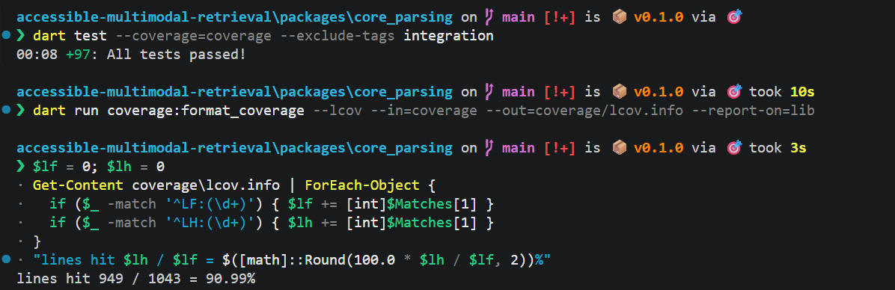
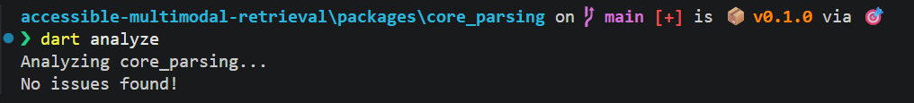
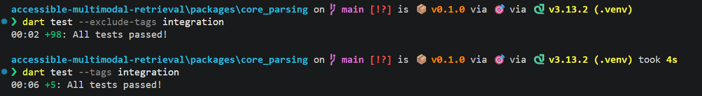
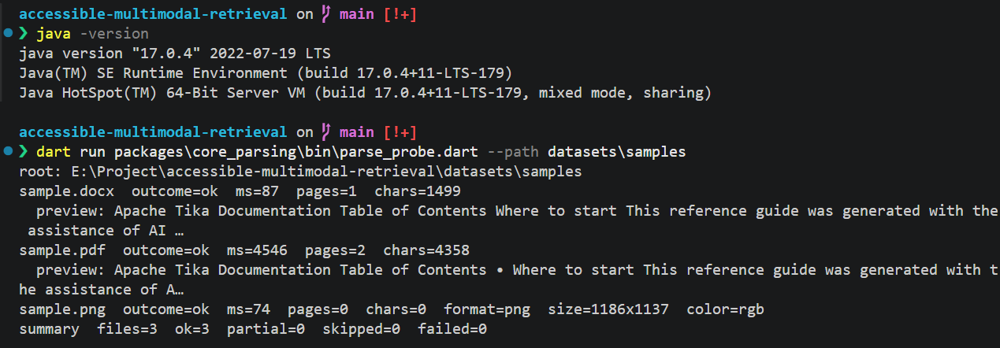
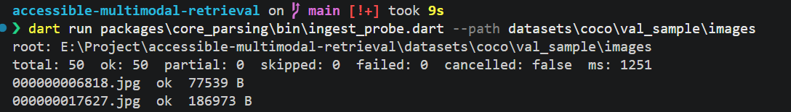
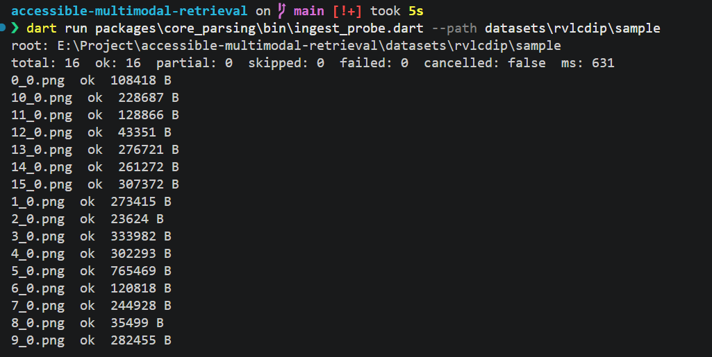
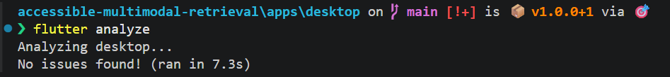

# W02 报告
---

## 1. 测试范围与环境

### 1.1 测试范围

- 默认单测：`dart test --exclude-tags integration`
- 集成单测：`dart test --tags integration`
- `datasets/samples` 三文件探针，coco 50 张与 rvlcdip 16 张入库探针
- `lib/` 行覆盖率，`--report-on=lib`
- `apps/desktop` 的 `flutter analyze`

### 1.2 测试环境

操作系统：Microsoft Windows 11 25H2
Dart：3.13.4（stable）
Flutter：stable 3.47.5，安装路径 `D:\flutter`
Java：17.0.4 LTS，`JAVA_HOME` 为 `C:\Program Files\Java\jdk-17.0.4`
Apache Tika：tika-app 4.0.0，`tools/tika-app`
解析包：`packages/core_parsing`

---

## 2. 用例统计

| 模块 | 用例 ID | 用例数 | 通过 | 失败 | 未测 |
|---|---|---|---|---|---|
| TXT | PAR-01 ~ PAR-07 | 7 | 7 | 0 | 0 |
| 注册表 | PAR-08 ~ PAR-10 | 3 | 3 | 0 | 0 |
| DOCX | PAR-11 ~ PAR-14 | 4 | 4 | 0 | 0 |
| Tika CLI | PAR-15 ~ PAR-18 | 4 | 4 | 0 | 0 |
| PDF | PAR-19 ~ PAR-21 | 3 | 3 | 0 | 0 |
| 图像 | PAR-22 ~ PAR-24 | 3 | 3 | 0 | 0 |
| 扫描 | ING-01 ~ ING-03 | 3 | 3 | 0 | 0 |
| 元数据 | ING-04 ~ ING-06 | 3 | 3 | 0 | 0 |
| 入库 | ING-07 ~ ING-10 | 4 | 4 | 0 | 0 |
| **合计** | — | **34** | **34** | **0** | **0** |

覆盖率单独见 `覆盖率报告.md`，不计入上表。

默认套件结束行是 `00:01 +98: All tests passed!`。集成套件结束行是 `00:06 +5: All tests passed!`。`--reporter expanded` 的进度刷新被采集成重复行，同一条用例名会出现多次。判定看结束行，不看重复次数。

---

## 3. 用例表

命令在 `packages/core_parsing` 下执行，除非另注「仓库根目录」。

| 用例 ID | 命令 | 期望 | 实际 | 判定 | 证据 |
|---|---|---|---|---|---|
| PAR-01 | `dart test --exclude-tags integration` | UTF-8 正文与夹具一致 | `utf-8 fixture keeps Chinese and normalizes CRLF`：正文 `Hello core_parsing.` 加换行和 `第二行：中文内容。`，outcome 为 ok | 通过 | `logs/dart_test.txt` |
| PAR-02 | 同上 | UTF-8 BOM 正文一致，标记被去掉 | `utf-8 BOM fixture strips the mark`：正文 `BOM prefixed ASCII and 中文。`，无 warning | 通过 | `logs/dart_test.txt` |
| PAR-03 | 同上 | UTF-16 中文一致 | LE 夹具正文 `UTF-16LE 中文`；BE 字节正文 `BE 中文`。两条都是 ok | 通过 | `logs/dart_test.txt` |
| PAR-04 | 同上 | GBK 中文一致 | `gbk fixture falls back and records the warning`：正文 `GBK: 中文测试`，warning 为 `encoding-fallback:gbk` | 通过 | `logs/dart_test.txt` |
| PAR-05 | 同上 | 空文件为 ok | `empty file is ok with an empty body`：正文空，一页，ok | 通过 | `logs/dart_test.txt` |
| PAR-06 | 同上 | 无换行的大单行，未超上限，为 ok | `a newline-free line under the ceiling stays ok`：一行 520 字符，无换行，走默认上限。正文与原文一致，warnings 为空，outcome 为 ok | 通过 | `logs/dart_test.txt` |
| PAR-07 | 同上 | 超过上限为 partial，并带截断标记 | `bytes past the ceiling are partial and truncated`：`TxtParser(maxBytes: 4)` 读 `abcdefg`，正文 `abcd`，warning `truncated:4`，partial | 通过 | `logs/dart_test.txt` |
| PAR-08 | 同上 | 已知扩展名命中解析器 | `a matching parser is invoked`：`A.TXT` 调用 stub | 通过 | `logs/dart_test.txt` |
| PAR-09 | 同上 | 未知扩展名为 `unsupportedFormat`，不抛异常 | `an unknown extension is skipped and does not throw`：`picture.bin` 的 kind 为 `unsupportedFormat`，outcome 为 skipped | 通过 | `logs/dart_test.txt` |
| PAR-10 | 同上 | `.TXT` / `.Pdf` 命中 | `extensions match regardless of case or a leading dot`：`.TXT`、`Pdf`、`Notes.Pdf` 都命中 stub | 通过 | `logs/dart_test.txt` |
| PAR-11 | 同上 | 正常 docx 正文非空，并带 title / creator | `minimal fixture yields paragraphs and core properties`：夹具 title 为 `Core Parsing Fixture`。`sample.docx has body text and a creator`：正文含 Apache Tika，creator 为 Mengxiao Wu。`dc:title` 是空元素，测试只断言这个键存在 | 通过 | `logs/dart_test.txt` |
| PAR-12 | 同上 | 缺少 `word/document.xml` 为 failed | `a zip without document.xml is failed`：`corruptedInput`，消息含 `word/document.xml` | 通过 | `logs/dart_test.txt` |
| PAR-13 | 同上 | 损坏 zip 为 failed | `a corrupt zip is failed and names the reason`：`corruptedInput`，消息含 zip | 通过 | `logs/dart_test.txt` |
| PAR-14 | 同上 | 没有 `docProps` 时正文可用，title 为 null | `tabs and line breaks inside a paragraph are kept`：正文 `A`、制表符、`B`、换行、`C`。夹具只有 `word/document.xml`。测试没有断言 title。实现上缺少 core.xml 时属性表为空 | 通过 | `logs/dart_test.txt` |
| PAR-15 | 同上 | `-x` 多页成功 | `xhtml pages are split and entities are decoded`：假 `ProcessRunner`，按 page div 切页。不启动 Java | 通过 | `logs/dart_test.txt` |
| PAR-16 | 同上 | 没有 page div 时回退 `-t`，得到单页 | `xhtml without page divs falls back to plain text`：第二次调用带 `-t`，正文为 fallback。`-x` 退出码非 0 且没有页时也会回退，见 `a failed xhtml run falls back to plain text`。超时不回退 | 通过 | `logs/dart_test.txt` |
| PAR-17 | 同上 | 进程非 0 退出为失败，stderr 保留 | `both modes failing throws and keeps stderr off the message`：两次退出码都是 2，抛 `TextExtractionException`，stderr 为 `java failed`，消息不含 stdout。`PdfParser` 把该异常记成 `corruptedInput` / failed | 通过 | `logs/dart_test.txt` |
| PAR-18 | 同上 | Java 缺失时降级，不崩溃 | 提取器测试抛 `ProcessStartException`。`a missing java runtime is dependencyUnavailable`：`PdfParser` 记 `dependencyUnavailable` / failed。任务表里的名字是 ParserUnavailable，代码里的 kind 是 `dependencyUnavailable` | 通过 | `logs/dart_test.txt` |
| PAR-19 | `dart test --tags integration` | `sample.pdf` 为 2 页、正文非空、ok | `sample.pdf yields two pages through Tika`：pageCount 为 2，正文含 Apache Tika。同一次集成套件里还有 Tika CLI 的 `sample.pdf yields two pages through the real Tika CLI`。探针：`sample.pdf outcome=ok ms=5215 pages=2 chars=4358` | 通过 | `logs/dart_test.txt`；`logs/ingest_samples.txt` |
| PAR-20 | `dart test --exclude-tags integration` | 加密 PDF 为 failed，并记下原因 | `an encrypted pdf keeps the extractor reason`：假提取器抛出 `PDF is encrypted.`，kind 为 `corruptedInput`，detail 为 stderr | 通过 | `logs/dart_test.txt` |
| PAR-21 | 同上 | 0 字节 PDF 为 failed | `an empty pdf fails before the extractor runs`：消息 `PDF is empty.`，`corruptedInput`，提取器未被调用 | 通过 | `logs/dart_test.txt` |
| PAR-22 | 同上 | PNG 给出尺寸和格式 | `sample.png reports size, format, and rgb`：1186×1137，format 为小写 `png`，color 为小写 `rgb`。探针同一尺寸，ms=80 | 通过 | `logs/dart_test.txt`；`logs/ingest_samples.txt` |
| PAR-23 | 同上 | JPEG 给出尺寸和格式 | `a jpeg reports format and a positive size`：包内夹具 `tiny.jpg`。coco 的 `000000006818.jpg` 在集成套件，不在默认套件 | 通过 | `logs/dart_test.txt` |
| PAR-24 | 同上 | 伪装成图片的非图片为 failed | `a non-image with an image extension fails`。另有 `an empty image file fails as corrupted input`：空字节 PNG 为 `corruptedInput` | 通过 | `logs/dart_test.txt` |
| ING-01 | 同上 | 递归结果包含子目录文件 | `fixtures include nested files and skip hidden and temp names`：结果含 `nested/a.txt`，且已按路径排序 | 通过 | `logs/dart_test.txt` |
| ING-02 | 同上 | 不含 `~$` 和点开头的名字 | 同一条夹具测试要求点开头与 `~$` 为空。`hidden directories, temp files, and system directories are skipped`：目录里只剩下 `keep.txt` | 通过 | `logs/dart_test.txt` |
| ING-03 | 同上 | 只保留白名单扩展名 | 上一条临时目录里的 `notes.bin` 不在结果中。白名单是 `.txt .pdf .docx .jpg .jpeg .png` | 通过 | `logs/dart_test.txt` |
| ING-04 | 同上 | 同一文件两次 SHA-256 一致 | `content hash is stable and times are present`：两次 `contentHash` 相等 | 通过 | `logs/dart_test.txt` |
| ING-05 | 同上 | 时间字段非空 | 同一条测试：`modifiedAt`、`accessedAt`、`createdAt` 都非空。`createdAt` 来自 `stat.changed` | 通过 | `logs/dart_test.txt` |
| ING-06 | 同上 | 中文路径不抛异常 | 同一条测试的相对路径是 `中文目录/说明.txt`，文件名 `说明.txt` | 通过 | `logs/dart_test.txt` |
| ING-07 | `dart test --tags integration`；仓库根目录再跑两条 `ingest_probe` | 50 + 16 = 66 条，0 崩溃 | 集成测试 `coco and rvlcdip yield 66 image records without failures`。探针：coco `total: 50 ok: 50 failed: 0 ms: 1400`；rvlcdip `total: 16 ok: 16 failed: 0 ms: 651` | 通过 | `logs/dart_test.txt`；`logs/ingest_samples.txt` |
| ING-08 | `dart test --exclude-tags integration` | 坏文件被隔离，其余文件仍成功 | `a corrupt file is isolated and the rest still succeed`：total 2，succeeded 1，failed 1，cancelled 为 false | 通过 | `logs/dart_test.txt` |
| ING-09 | 同上 | 空目录得到空报告 | `an empty directory is an empty report`：total 0，cancelled 为 false | 通过 | `logs/dart_test.txt` |
| ING-10 | 同上 | 取消后停止，报告 `cancelled` | `cancel before start yields a cancelled empty report`：cancelled，total 0。`cancel after the first file stops the rest`：cancelled，total 小于 4 且大于 0 | 通过 | `logs/dart_test.txt` |

---

## 4. 探针与静态检查

这些不在矩阵编号里，对应验收清单第 1、3、4、5 条。

| 检查 | 命令 | 实际 | 证据 |
|---|---|---|---|
| 包静态检查 | `packages\core_parsing` 下 `dart analyze` | `No issues found!` | `logs/dart_analyze.txt`；`screenshots/dart-analyze.png` |
| 默认测试 | `dart test --exclude-tags integration` | `00:01 +98: All tests passed!` | `logs/dart_test.txt`；`screenshots/dart-test.png` |
| 集成测试 | `dart test --tags integration` | `00:06 +5: All tests passed!` | 同上 |
| samples 探针 | 仓库根目录 `dart run packages\core_parsing\bin\parse_probe.dart --path datasets\samples` | docx ok，80 ms，1 页，1499 字符；pdf ok，5215 ms，2 页，4358 字符；png ok，80 ms，1186×1137，png / rgb。`summary files=3 ok=3 failed=0` | `logs/ingest_samples.txt`；`screenshots/parse-probe.png` |
| coco | `dart run packages\core_parsing\bin\ingest_probe.dart --path datasets\coco\val_sample\images` | total 50，ok 50，failed 0，1400 ms | `logs/ingest_samples.txt`；`screenshots/ingest-coco.png` |
| rvlcdip | `dart run packages\core_parsing\bin\ingest_probe.dart --path datasets\rvlcdip\sample` | total 16，ok 16，failed 0，651 ms | `logs/ingest_samples.txt`；`screenshots/ingest-rvlcdip.png` |
| 桌面工程 | `apps\desktop` 下 `flutter analyze` | `No issues found! (ran in 7.6s)` | `logs/flutter_analyze.txt`；`screenshots/flutter-analyze.png` |
| 覆盖率 | 见 `覆盖率报告.md` | 949 / 1043 = 90.99% | `logs/coverage.txt`；`coverage/lcov.info`；`screenshots/coverage-percent.png` |

`ingest_samples.txt` 里，docx 和 pdf 的预览行在采集时把省略号和下一行拼到了一起。上表用的是 outcome、页数、字符数和 summary，不依赖那两行预览的换行。

samples 探针里只有 pdf 启动 JVM。Day 3 同目录的 pdf 是 4857 ms（`logs/day3_jvm_single_file.txt`）。Day 4 这次是 5215 ms。

---

## 5. 证据索引

| 路径 | 对应内容 |
|---|---|
| `reports/week2/logs/dart_analyze.txt` | PAR 默认套件所在包的静态检查 |
| `reports/week2/logs/dart_test.txt` | PAR-01..18、PAR-20..24、ING-01..06、ING-08..10，以及 PAR-19、PAR-23 的 coco 条、ING-07 |
| `reports/week2/logs/coverage.txt` | D3 命令和百分比 |
| `reports/week2/logs/ingest_samples.txt` | PAR-19、PAR-22、ING-07 的探针，以及 Java 版本 |
| `reports/week2/logs/flutter_analyze.txt` | 验收清单第 5 条 |
| `reports/week2/logs/day3_jvm_single_file.txt` | Day 3 的单文件 JVM 耗时，已在 `fb5a162` |
| `reports/week2/coverage/lcov.info` | D3 的 lcov |
| `reports/week2/覆盖率报告.md` | 百分比说明 |
| `reports/week2/screenshots/*.png` | 第 4 节各条命令的终端截屏 |
| `docs/api/parsing-module-api.md` | D5 |
| `docs/tdd/technical-design-document.md` | D6 |

---

## 6. 结论与限制

解析包可以在默认套件全绿的前提下解析四种文本路径和两种图像，并把 coco 50 张与 rvlcdip 16 张记成报告。坏文件、空目录、取消和坏根目录都落在报告里。覆盖率 90.99%。

限制：

- PAR-14 的测试没有断言 title 缺失。
- `dart_test.txt` 没有逐条列出全部 98 个名字。expanded 进度被拆行了，结束行是 +98 和 +5。
- 覆盖率不含真 Java。`sample.pdf` 的 2 页在集成套件和探针里，不在 lcov 里。
- PDF 单文件 5215 ms，含一次 JVM 启动。W2 仍是每个 PDF 一个进程。
- 图像格式字符串是小写 `png` / `jpeg`，色彩模式是小写 `rgb`。
- DOCX 解析器不调用 Tika。架构图里的 DOCX 回退没有实现。
- 数据集图片不在 git 里。干净克隆跑不了 `dart test --tags integration` 里的 coco / rvlcdip 两条，除非本机自备这些文件。
